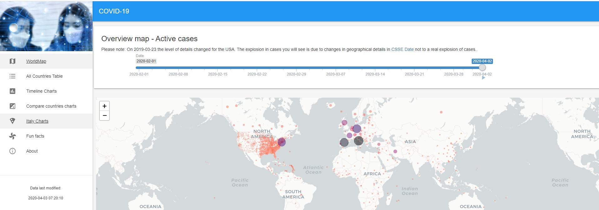

# covid19-dashboard

---

- Developed by: [Sebastian Engel-Wolf](https://www.mail-wolf.de)
- App on gallery: https://gallery.shinyapps.io/covid19-dashboard
- Original code: https://github.com/zappingseb/coronashiny

---

## App

You can run the app by using

```r
install.packages(c("dplyr", "shiny", "shinymaterial", "plotly", "viridisLite", "tidyverse", "shinyWidgets", "DT", "RColorBrewer", "shinyjs", "leaflet", "leaflet.extras", "scales"))

shiny::runApp("covid19-dashboard")
```



The app is also deployed at: https://sebastianwolf.shinyapps.io/Corona-Shiny/

## Map

You can view the map opening `leaflet_markdown` in RStudio and running: "Knit"

## About

Sebastian Engel-Wolf is a Freelance Scientific Software Developer. You can find him on:

* LinkedIn: https://www.linkedin.com/in/zappingseb/
* Homepage: https://www.mail-wolf.de
* Twitter: twitter.com/zappingseb
