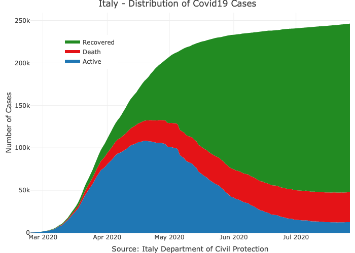
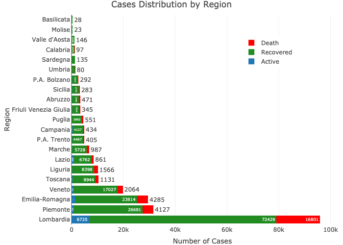

<!-- README.md is generated from README.Rmd. Please edit that file -->

# covid19italy

<!-- badges: start -->

[](https://github.com/RamiKrispin/actions?query=workflow%3Abuild)
[](https://cran.r-project.org/package=covid19italy)
[](https://www.tidyverse.org/lifecycle/#experimental)
[](https://opensource.org/licenses/MIT)
[](https://github.com/covid19r/commit/master)

<!-- badges: end -->

The covid19italy R package provides a tidy format dataset of the 2019
Novel Coronavirus COVID-19 (2019-nCoV) pandemic outbreak in Italy. The
package includes the following three datasets:

-   `italy_total` - daily summary of the outbreak on the national level
-   `italy_region` - daily summary of the outbreak on the region level
-   `italy_province` - daily summary of the outbreak on the province
    level

More information about the package datasets available
[here](https://covid19r.github.io/articles/intro.html), and supporting
dashboard available [here](https://ramikrispin.github.io/italy_dash/).

Data source: [Italy Department of Civil
Protection](http://www.protezionecivile.it/)

[](https://covid19r.github.io/articles/geospatial_visualization.html)

## Installation

You can install the released version of covid19italy from
[CRAN](https://cran.r-project.org/package=covid19italy) with:

``` r
install.packages("covid19italy")
```

Or, install the most recent version from
[GitHub](https://github.com/Covid19R/covid19italy) with:

``` r
# install.packages("devtools")
devtools::install_github("RamiKrispin/covid19Italy")
```

## Data refresh

While the **covid19italy** [CRAN
version](https://cran.r-project.org/package=covid19italy) is updated
every month or two, the [Github (Dev)
version](https://github.com/RamiKrispin/covid19italy) is updated on a
daily bases. The `update_data` function enables to overcome this gap and
keep the installed version with the most recent data available on the
Github version:

``` r
library(covid19italy)

update_data()
```

**Note:** must restart the R session to have the updates available

## Usage

``` r
data(italy_total)

head(italy_total)
#>         date hospitalized_with_symptoms intensive_care total_hospitalized
#> 1 2020-02-24                        101             26                127
#> 2 2020-02-25                        114             35                150
#> 3 2020-02-26                        128             36                164
#> 4 2020-02-27                        248             56                304
#> 5 2020-02-28                        345             64                409
#> 6 2020-02-29                        401            105                506
#>   home_confinement cumulative_positive_cases daily_positive_cases recovered
#> 1               94                       221                    0         1
#> 2              162                       311                   90         1
#> 3              221                       385                   74         3
#> 4              284                       588                  203        45
#> 5              412                       821                  233        46
#> 6              543                      1049                  228        50
#>   death positive_clinical_activity positive_surveys_tests cumulative_cases
#> 1     7                         NA                     NA              229
#> 2    10                         NA                     NA              322
#> 3    12                         NA                     NA              400
#> 4    17                         NA                     NA              650
#> 5    21                         NA                     NA              888
#> 6    29                         NA                     NA             1128
#>   total_tests total_people_tested
#> 1        4324                  NA
#> 2        8623                  NA
#> 3        9587                  NA
#> 4       12014                  NA
#> 5       15695                  NA
#> 6       18661                  NA
```

### Plotting the active cases distribution

``` r
library(plotly)

plot_ly(data = italy_total,
        x = ~ date,
        y = ~home_confinement, 
        name = 'Home Confinement', 
        fillcolor = '#FDBBBC',
        type = 'scatter',
        mode = 'none', 
        stackgroup = 'one') %>%
  add_trace( y = ~ hospitalized_with_symptoms, 
             name = "Hospitalized with Symptoms",
             fillcolor = '#E41317') %>%
  add_trace(y = ~intensive_care, 
                name = 'Intensive Care', 
                fillcolor = '#9E0003') %>%
  layout(title = "Italy - Distribution of Active Covid19 Cases",
         legend = list(x = 0.8, y = 0.9),
         yaxis = list(title = "Number of Cases"),
         xaxis = list(title = "Source: Italy Department of Civil Protection"))
```


### Plotting the daily cases distribution

``` r
plot_ly(data = italy_total,
        x = ~ date,
        y = ~ cumulative_positive_cases, 
        name = 'Active', 
        fillcolor = '#1f77b4',
        type = 'scatter',
        mode = 'none', 
        stackgroup = 'one') %>%
  add_trace( y = ~ death, 
             name = "Death",
             fillcolor = '#E41317') %>%
  add_trace(y = ~recovered, 
            name = 'Recovered', 
            fillcolor = 'forestgreen') %>%
  layout(title = "Italy - Distribution of Covid19 Cases",
         legend = list(x = 0.1, y = 0.9),
         yaxis = list(title = "Number of Cases"),
         xaxis = list(title = "Source: Italy Department of Civil Protection"))

```



### Cases distribution by region

``` r
italy_region %>% 
  filter(date == max(date)) %>% 
  select(region_name, cumulative_positive_cases, recovered, death, cumulative_cases) %>%
  arrange(-cumulative_cases) %>%
  mutate(region = factor(region_name, levels = region_name)) %>%
  plot_ly(y = ~ region, 
          x = ~ cumulative_positive_cases, 
          orientation = 'h',
          text =  ~ cumulative_positive_cases,
          textposition = 'auto',
          type = "bar", 
          name = "Active",
          marker = list(color = "#1f77b4")) %>%
  add_trace(x = ~ recovered,
            text =  ~ recovered,
            textposition = 'auto',
            name = "Recovered",
            marker = list(color = "forestgreen")) %>%
  add_trace(x = ~ death, 
            text =  ~ death,
            textposition = 'auto',
            name = "Death",
            marker = list(color = "red")) %>%
  layout(title = "Cases Distribution by Region",
         barmode = 'stack',
         yaxis = list(title = "Region"),
         xaxis = list(title = "Number of Cases"),
         hovermode = "compare",
         legend = list(x = 0.65, y = 0.9),
         margin =  list(
           l = 20,
           r = 10,
           b = 10,
           t = 30,
           pad = 2
         )) 
```



### Cases distribution by province for Lombardia region

``` r
italy_province %>% 
  filter(date == max(date), region_name == "Lombardia") %>%
  plot_ly(labels = ~province_name, values = ~total_cases, 
                  textinfo="label+percent",
                  type = 'pie') %>%
  layout(title = "Lombardia - Cases Distribution by Province") %>% 
  hide_legend()
```


## Supporting Dashboard

A supporting dashboard for the **covid19italy** datasets available
[here](https://ramikrispin.github.io/italy_dash/).


