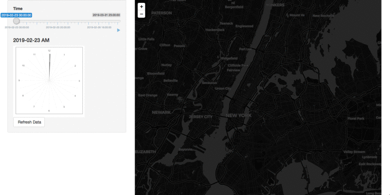

# Animated NYC metro traffic

---

- Developed by: [Tiger Tang](https://community.rstudio.com/u/tiger/)
- App on gallery: https://gallery.shinyapps.io/nyc-metro-vis

---

Wonder what one week of metro traffic would look like? Wanna see the heaviest/lightest traffic times for your NYC metro stops? Check out this app [here](https://gallery.shinyapps.io/nyc-metro-vis/).

## Background 

Inspired by the awesome visualizations about MTA Turnstile Data from [Chris Whong’s visualization](https://chriswhong.com/open-data/visualizing-the-mtas-turnstile-data/) and I wondered if similar stuff can be done with Shiny. 

In the gif below, you can see an 'animated' leaflet map that shows whether or not a lot of people are entering a metro station in NYC at different times of the week from 02-23-2019 to 03-01-2019. The data source contains more specific time stamps and you can see the changes of the number of people entering different station at different hours of the day. The data can be found [here](http://web.mta.info/developers/).

This was submitted for the 1st Shiny Contest by RStudio and was recognized with an honorable mention. Currently listed on the [Shiny Gallery](https://shiny.rstudio.com/gallery/nyc-metro.html).

## Vis insights:

+ The dots are representing the number of people entering the specific station. (Blue < Pink < Red < Orange)
+ The size of the dots reflect the number of people too.
+ The map background will change from day to night and night to day according to the average time of the sunrise and sunset of that week.
+ See that less people are using metro at mid night and much more people are using it at rush hour. See the size of the circle during weekend vs weekdays.

## Behind the scenes:

+ The `sliderinput` with a play button made the animation possible.
+ The clock is made with `ggplot`.
+ `RenderCachePlot` was used for faster generation with the clock.
+ `Promises` were used with data update.
