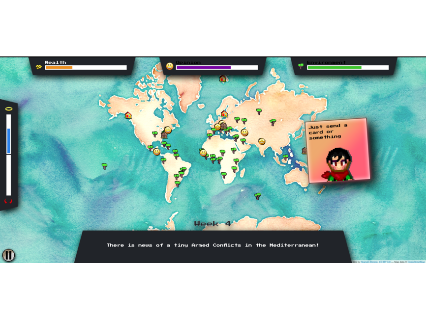
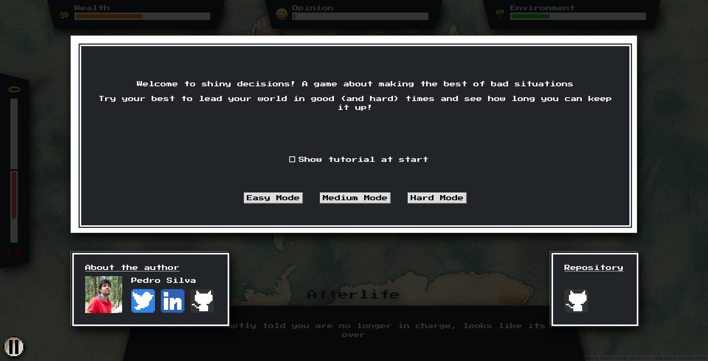
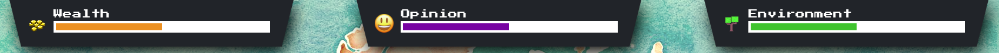
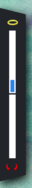
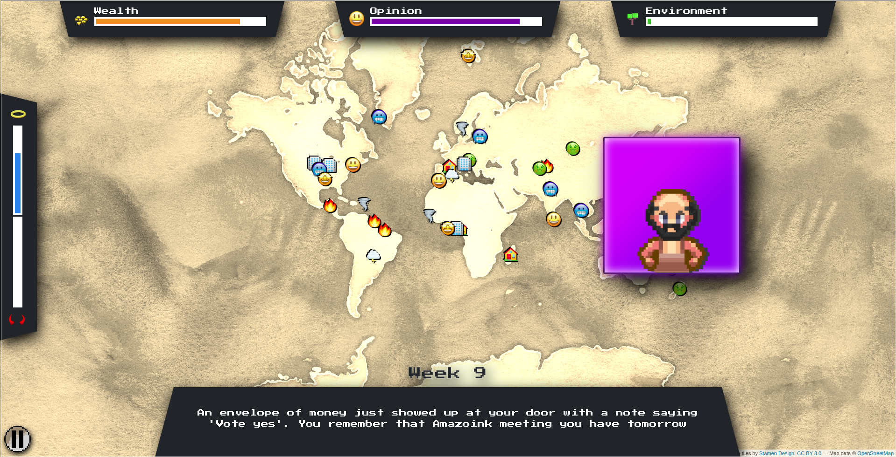
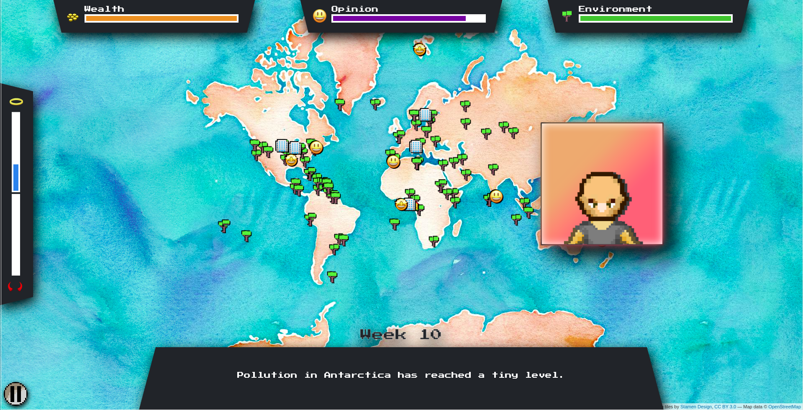
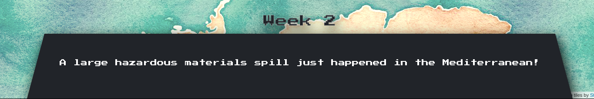
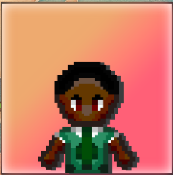
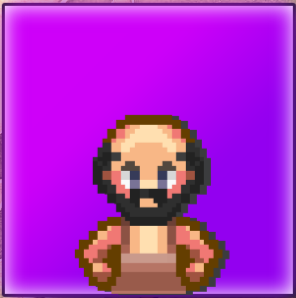
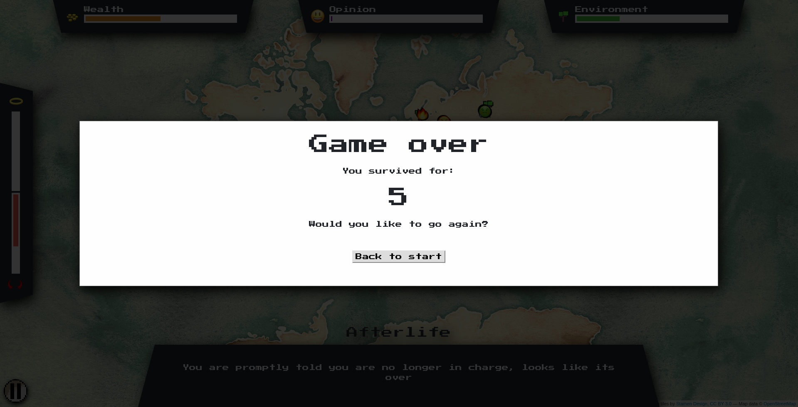

# shiny-decisions

---

- Developed by: [Pedro Silva](https://github.com/pedrocoutinhosilva)
- App on gallery: https://gallery.shinyapps.io/shiny-decisions
- Original code: https://github.com/pedrocoutinhosilva/shiny.decisions

---

A game about making the best of terrible choices

In shiny decisions your goal is to last as long as possible while making decisions that affect the wealth, population and environment quality in the world.

If any of those metrics reaches zero, its game over! How long can you last?



---

# Installation
Some of the packages included in this project are currently only available on github. This includes `shiny.grid` and `shiny.blank`. To install them locally remember to run on your machine the following commands:

```
library(devtools)
install.packages(devtools)
devtools::install_github('pedrocoutinhosilva/shiny.grid')
devtools::install_github('pedrocoutinhosilva/shiny.blank')
```

---

# Starting a game
From the start game screen you will be able to start a new in any difficulty (Easy, medium or hard).


You can also toggle the tutorial on and of if you already know the basics of the game.


---

# During the game
The game UI has 3 main areas:

#### Metrics
Displays the current value of the different metrics you need to manage. Those metrics include:
- **Karma:** Being too bad or too good wont lose you the game, but might have some hidden effects...
- **Wealth:** Things cost money. No money no fun :/
- **Public opinion:** If no one likes you, you probably wont last long in power!
- **Environment:** If the world is beyond saving, whats the point?

The game metrics:


The karma meter:  


#### Map
A visual representation of what effects your actions are having in the world. Icons and the map color with change depending on how high or low some metrics are.

Low metrics:  


High metrics:  



#### current task
Your next task and the way you can move forward in the game. Above the task you can also see the current week in game. Every task you complete will move the game forward 1 week.


Card colors reflect the card pool and severity of the current card. The darker the card the more severe the task is, and more change it will have on the metrics. Currently 3 cards pools are implemented:

Bad cards (Cards that will have mostly negative consequences, red background):


Good cards (Cards that will have mostly good consequences, green background):


Special cards (Cards that will have unique consequences, purple background):


If you want to know more about all the possible cards and options available, you can check the google spreadsheet containing all possibilities at:  
https://docs.google.com/spreadsheets/d/1LwIPKAxbKvuGyMKktcTVuYZbTda0WMQxmNMhxqaQhGg

#### Card stack
Each task as 2 possible decisions, left or right. Simply drag and hold the card to each side to see what decisions you can take. while holding the card the names of the metrics that will be affected by that decision will also blink. Drag and release to commit to your decision.


#### Game end
when one of the metrics reaches zero, the game is over and you will be taken to the end game screen. Here you can see how many weeks you lasted, as well as return to the initial screen in case you want to go again.


---

# Code Structure
Shiny.decisions takes full advantage of modules and R6 classes for managing the code complexity.
Most of the project is broken down into R6 managers that take care of specific parts of the workflow:

### Game Manager
The brain being the game flow. It manages all game dependencies and is responsible for high level actions that drive the state of the game.

### Data Manager
Connects and exposes all external data required by the app. This includes the main data storage regarding task cards, game options and game modes loaded from a google spreadsheet.

Most options and cards can be added or tweaked without code changes directly on the spreadsheets.

The current live spreadsheet can be found at:
https://docs.google.com/spreadsheets/d/1LwIPKAxbKvuGyMKktcTVuYZbTda0WMQxmNMhxqaQhGg

### State Manager
Stores information regarding the current state of the game. This includes the current value of the different metrics, map markers and state checks for specific game phases.

### Metrics Manager
Responsible for displaying the current state metrics on the UI.

### Map Manager
Responsible for displaying map information according to the the current state metrics on the UI.

### Deck Manager
Responsible for creating cards according to the game state and switching between card pools depending on the current game phase.

---

# Future improvements
A lot of ideas are still floating around on how to improve this application:

 - Leader board;
 - More cards!;
 - Special game modes with different decks and objectives;
 - Map interactions;
 - Power up modifiers;

Got any more ideas, questions or feedback? Feel free to get in touch!
 - Twitter: https://twitter.com/sparktuga
 - linkedin: https://www.linkedin.com/in/pedrocoutinhosilva

---

# Links
#### Useful references
 - Modules: https://shiny.rstudio.com/articles/modules.html
 - R6 classes: https://adv-r.hadley.nz/r6.html
 - SASS: https://github.com/rstudio/sass

#### Assets
 - Images: https://opengameart.org/
 - NES.css framework: https://nostalgic-css.github.io/NES.css/

#### Dependencies
 - Shiny.grid: https://github.com/pedrocoutinhosilva/shiny.grid
 - Shiny.blank: https://github.com/pedrocoutinhosilva/shiny.blank
 - Hammer.js: https://hammerjs.github.io/
 - Swipe cards: https://github.com/simonepm/likecarousel
 - Leaflet for R: https://rstudio.github.io/leaflet/

#### Data
 - Google spreadsheet database: https://docs.google.com/spreadsheets/d/1LwIPKAxbKvuGyMKktcTVuYZbTda0WMQxmNMhxqaQhGg
 - World cities dataset: https://simplemaps.com/data/world-cities
 - World capitals dataset: https://www.kaggle.com/nikitagrec/world-capitals-gps
